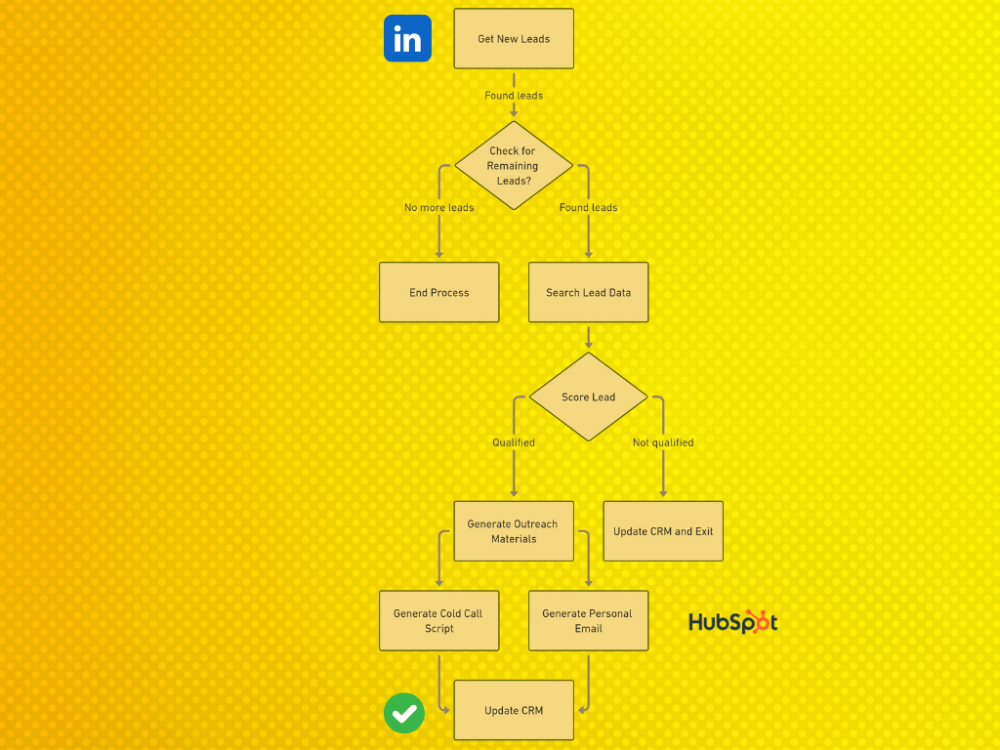
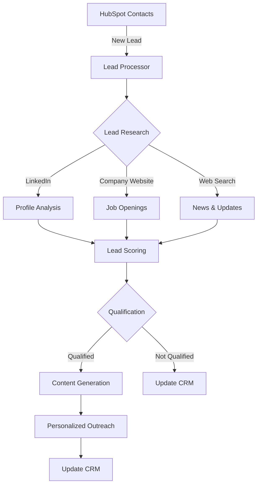

# AI Sales Outreach Automation 🚀

[](https://www.python.org/downloads/)
[](https://opensource.org/licenses/MIT)
[](https://github.com/psf/black)
[]()

An intelligent sales outreach automation system powered by LangGraph that seamlessly integrates with HubSpot and LinkedIn. Automate lead research, scoring, and personalized communication at scale.



## 🌟 Features

- **Automated Lead Processing**
  - Real-time HubSpot contact monitoring
  - Intelligent LinkedIn profile analysis
  - Company website scraping for job openings
  - Automated lead scoring and qualification

- **Smart Content Generation**
  - Personalized email templates
  - Custom video scripts
  - Tailored call scripts
  - Pain point identification

- **CRM Integration**
  - Bi-directional HubSpot sync
  - Automated contact updates
  - Lead status tracking
  - Activity logging

## 🔄 System Architecture



## 🛠️ Tech Stack

- **Core Framework**: [LangGraph](https://github.com/langchain-ai/langgraph) - For AI workflow orchestration
- **LLM Management**: [LiteLLM](https://github.com/BerriAI/litellm) - For multi-model LLM support
- **Models**: LLAMA-3, LLAMA-3.1 (via Groq)
- **APIs**: 
  - HubSpot CRM
  - LinkedIn Profile Data (RapidAPI)
  - Serper (Web Search)
  - Groq (LLM Inference)

## 📋 Prerequisites

- Python 3.9+
- Required API keys:
  - HubSpot Private App Token
  - RapidAPI Key (LinkedIn Data)
  - Serper API Key
  - Groq API Key
- Virtual environment (recommended)

## 🚀 Quick Start

1. **Clone & Setup**
```bash
git clone https://github.com/Kakachia777/Sales-Automation-Langraph.git
cd Sales-Automation-Langraph
python -m venv venv
source venv/bin/activate  # Windows: venv\Scripts\activate
pip install -r requirements.txt
```

2. **Configure Environment**
```bash
# Create .env file
cp .env.example .env

# Add your API keys
HUBSPOT_API_KEY=your_key
RAPIDAPI_KEY=your_key
SERPER_API_KEY=your_key
GROQ_API_KEY=your_key
```

3. **Run the Application**
```bash
python src/main.py
```

## 📊 Usage Examples

```python
from src.core.outreach import OutreachAutomation

# Initialize the automation
outreach = OutreachAutomation()

# Process new leads
outreach.process_new_leads()

# Generate personalized content
outreach.generate_content(lead_id="123")
```

## 🔧 Configuration

Customize the system behavior by modifying `src/config/settings.py`:

```python
# Lead scoring thresholds
MIN_QUALIFIED_SCORE = 50

# Target industries
TARGET_INDUSTRIES = ["Technology", "Finance", "Healthcare"]

# Location scoring
LOCATION_SCORES = {
    "US_EUROPE": 30,
    "OTHER": 10
}
```

## 📝 Testing

```bash
# Run all tests
pytest

# Run specific test category
pytest tests/test_lead_scoring.py
```

## 🤝 Contributing

1. Fork the repository
2. Create your feature branch (`git checkout -b feature/AmazingFeature`)
3. Commit your changes (`git commit -m 'Add some AmazingFeature'`)
4. Push to the branch (`git push origin feature/AmazingFeature`)
5. Open a Pull Request

## 📄 License

This project is licensed under the MIT License - see the [LICENSE](LICENSE) file for details.

## 📬 Contact

Your Name - [@Kakachia777](https://twitter.com/kakachia777) - Beka.kakachia777@gmail.com

Project Link: [https://github.com/Kakachia777/Sales-Automation-Langraph](https://github.com/Kakachia777/Sales-Automation-Langraph)

## 🙏 Acknowledgments

- [LangChain](https://github.com/langchain-ai/langchain) for the amazing LLM framework
- [HubSpot](https://www.hubspot.com/) for their comprehensive CRM API
- [Groq](https://groq.com/) for their fast LLM inference
